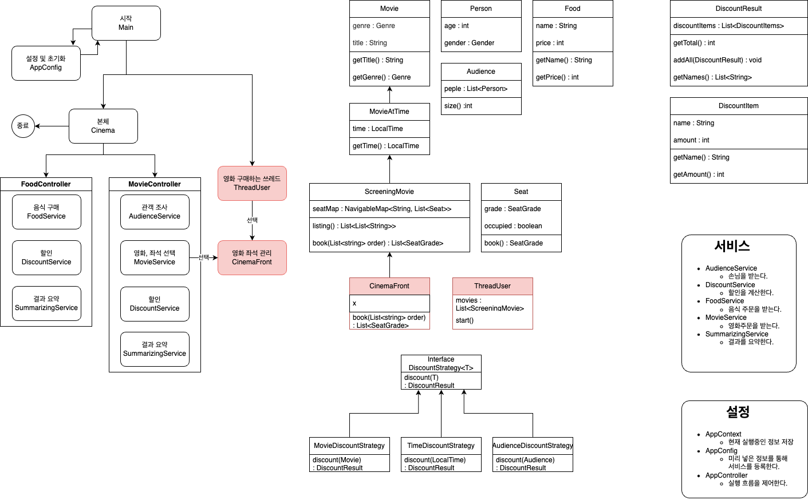
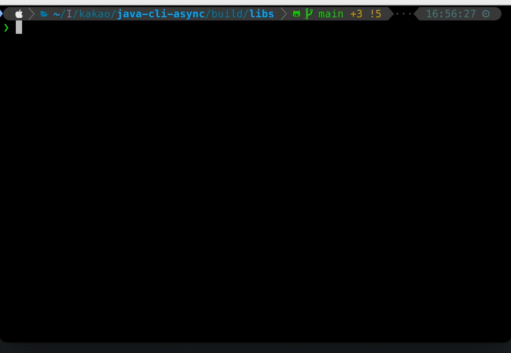

# CINEMA

# 실행 예시

# 클래스

## 설정 클래스

### AppConfig

어플리케이션 초기화 및 의존성 해결

### Main
- AppConfig 생성
- ThreadUser 시작
- Cinema 시작

### Cinema
- 실질적으로 애플리케이션이 시작되는 클래스

## 컨트롤러 클래스

### MovieController
- 영화 선택, 좌석 선택을 받는 컨트롤러   
- AudienceService, MovieService를 이용해서 선택을 받고   
DiscountService, SummarizingService를 이용해서 결과를 출력합니다.

### FoodController
- 음식 선택을 받는 컨트롤러
- FoodService를 이용해서 선택을 받고,    
DiscountService, SummarizingService를 이용해서 결과를 출력합니다.

## 서비스 클래스

### FoodService
- 음식 선택을 받는 서비스
- 음식을 숫자로 나열하고, 숫자, 쉼표를 통한 입력을 받는다.

### AudienceService
- 입장 인원 정보를 받는 서비스
- 인원수를 입력받고, 나이, 성별을 입력 받는다.

### MovieService
- 영화 선택 정보를 받는 서비스
- 영화를 나열후 입력받고, 좌석을 나열 후 인원에 따라 입력받는다.

### DiscountService
- 할인을 계산하는 서비스
- 영화,인원,음식에 따른 할인 정보를 계산한다. 

### SummarizingService
- 결과를 출력해주는 서비스
- 가격, 선택 내역등을 출력한다.

### InputManager
- Input 관련된 함수를 정의한 클래스 
- 유틸 클래스에 가깝다
- 스캐너 인스턴스를 가지고 있으며, 입력 관련한 함수를 구현한다.

### OutputManager
- Input 관련된 함수를 정의한 클래스
- 유틸 클래스에 가깝다
- 로고를 출력하고 일관된 출력을 할 수 있게 돕는다.

## 도메인 클래스

### Movie
- 영화 제목, 영화 장르를 가지고 있는 영화 기초 클래스

### MovieAtTime
- Movie를 상속하며, 시간 정보를 추가한 클래스

### ScreeningMovie
- MovieAtTime을 상속하며, 좌석 정보를 추가한 클래스
- 좌석 예약, 좌석 나열 메소드를 가지고 있다.
- 좌석 정보를 관리하는 주체

### Seat
- 좌석 클래스
- 좌석 예약 여부, 좌석 등급을 가지고 있다.

### CinemaFront
- ScreeningMovie를 상속하며, 멀티스레드 환경에서 예약을 가능하게 한다.
- 예약 메소드를 오버라이딩하여, syncronized 된 예약 메소드를 구현한다.

### ThreadUser
- 여러 쓰레드를 통해 유저와 동시간대에 영화를 예매한다.
- 여러 영화중 랜덤하게 영화를 선택하고, 랜덤한 좌석을 골라 예매 시도한다.
  - 자리가 이미 예약되어 있다면 예약하지 못한다.
  - 예매 시도 N번 시행 후 종료된다.

### Person
- 나이, 성별을 가지고 있는 관객 단일 클래스

### Audience
- Person의 일급 컬렉션
- Person의 여러 인스턴스에 관한 함수를 모아 구현한 곳이다.

### Food
- 음식 이름, 가격을 가지고 있는 클래스
- AppConfig에서 하드코딩된 값으로 생성된다.

### DiscountStrategy
- 할인을 정의한 인터페이스
- 구현 클래스는
  - TimeDiscountStrategy : 시간에 대한 할인 
  - AudienceDiscountStrategy : 관객에 대한 할인
  - MovieDiscountStrategy : 영화에 대한 할인

### DiscountResult
- 할인 결과 전체를 가지고 있는 일급 컬렉션
- DiscountResult 끼리의 합, 이름 나열, sum 등 DiscountItem 다수와 관련된 함수들을 구현한다.

### DiscountItem
- 단일 할인 결과를 가지고 있는 클래스
- 이름, 할인 가격을 가지고 있다.

